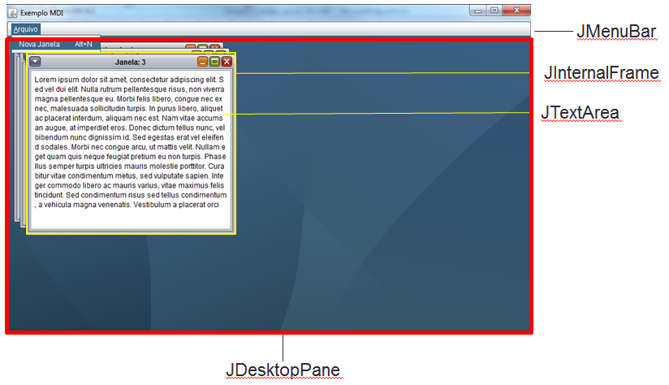

# Aula 6 - Multiple Document Interface (MDI) 
Introdução a aplicação com múltiplos documentos.

### Tarefa 1 - Criar interface que permita múltiplos documentos internos



1.1 Adicione uma barra de menu (_JMenuBar_) ao formulário ***MDIVIEW***.

1.2 Renomeie o primeiro menu (_JMenuItem_) para “Arquivo”.

1.3 Adicione um _JMenuItem_ ao menu “Arquivo” com a descrição “Nova janela” e 

1.4 Adicione um componente _JDesktopPane_ (Painel de Área de Trabalho)  ao formulário ***“MDIView”*** e redimensione-o para ocupar todo o espaço restante do formulário.

1.5 Crie uma classe nova, com um novo formulário do tipo _JInternalFrame_ chamado ***“FrameInterno”***. (para criar uma classe nova você deverá clicar na região onde estão os arquivos e selecionar "novo JInternalFrame". Se essa opção não estiver lá, você terá que procurar no menu "outros")

1.6 Inclua um controle JTextArea no formulário “FrameInterno”

1.7 Ao clicar no menu “Nova janela”: 
* Instancie um objeto da classe “FrameInterno” e defina seu tamanho inicial como 350x300 (_preferredSize_) e exiba o frame interno. Ex: <br />
```
FrameInterno janelaInterna = new FrameInterno();
janelaInterna.setVisible(true);

//Defino o tamanho da janela interna
janelaInterna.setPreferredSize(new Dimension(350,300));
```

* Adicione o objeto ao _JDesktopPane_ . Ex: <br />
```
this.nomeSeuDeskopPane.add(janelaInterna);
//Força o redimensionamento da janela ao tamanho preferido
janelaInterna.pack();
```


